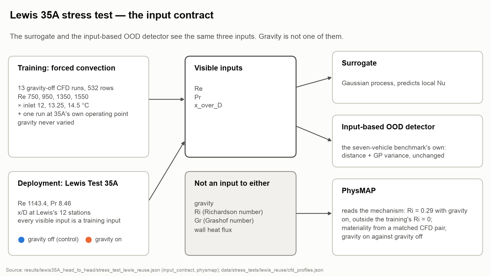
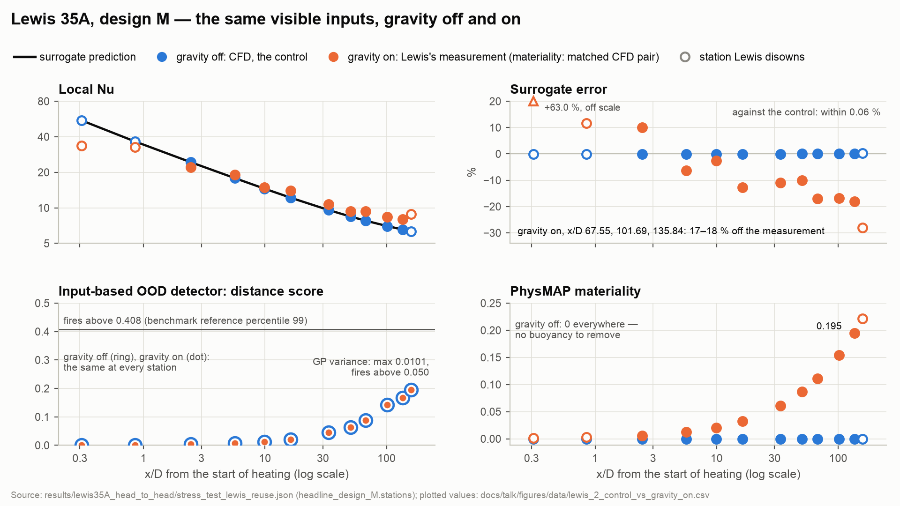
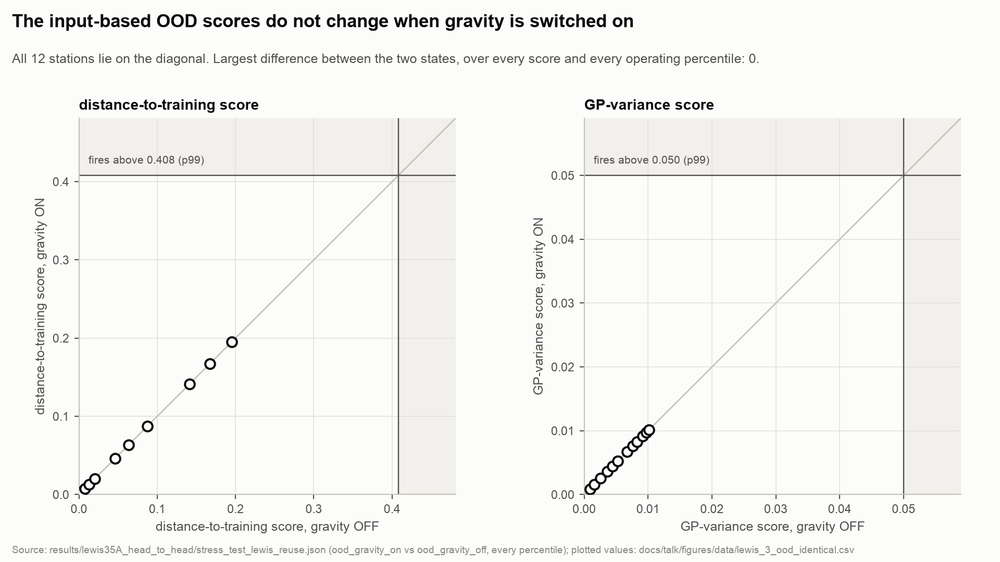
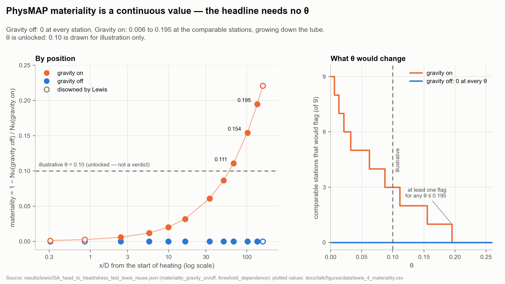
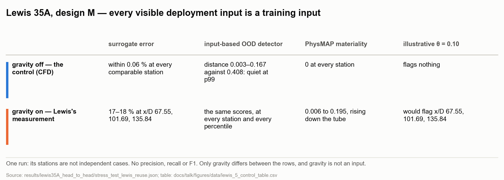
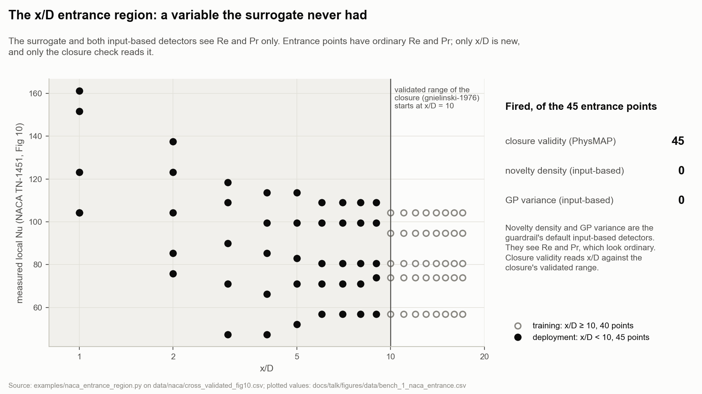
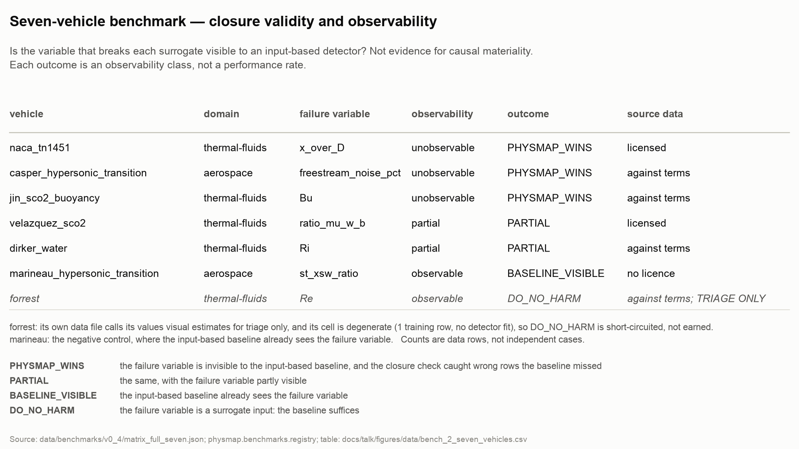
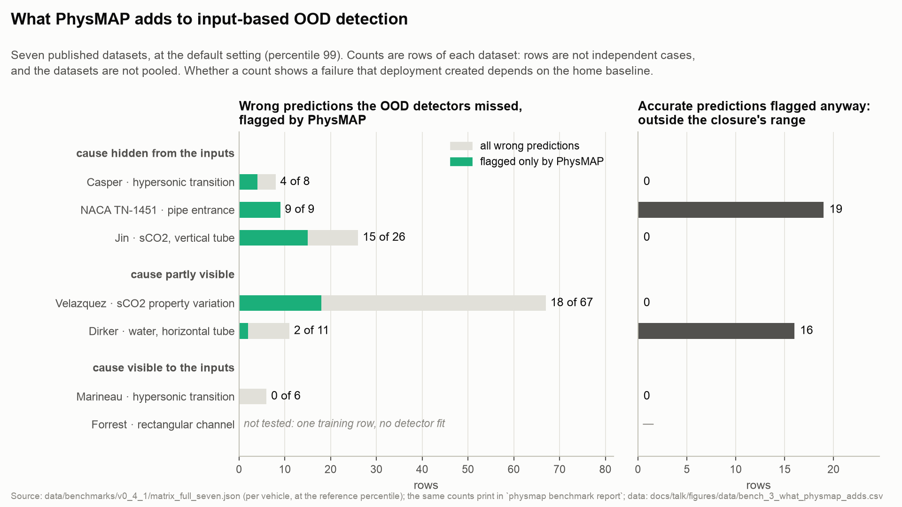
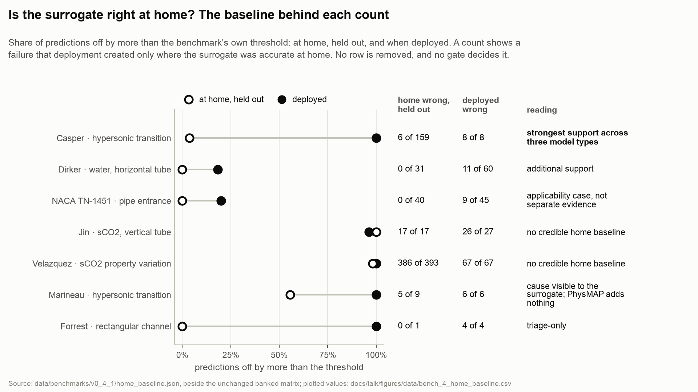

# Figures — generated, do not edit

Built by `python tools/talk_package.py build` from committed records only. Each figure ships as an editable vector SVG (text kept as text) and a 1920-pixel PNG for slides, and has a table twin in `data/` holding the plotted values. Blue is gravity off and orange is gravity on in every Lewis figure; the only dashed line is the illustrative θ. Light theme only: these are slide images, not interactive charts.

## Input contract: what the surrogate and the OOD detector see

The input contract. The surrogate and the input-based OOD detector both receive Re, Pr and x_over_D, and nothing else. Neither receives gravity, Ri, Gr or wall heat flux. Training: 13 gravity-off CFD runs, 532 rows, one run at 35A's own operating point. Deployment: Re 1143.4, Pr 8.46, at Lewis's 12 stations; every visible deployment input is a training input. PhysMAP reads Ri = 0.29 with gravity on, outside the surrogate's calibrated window (0 <= richardson_number <= 0).

- Files: [`lewis_1_input_contract.svg`](lewis_1_input_contract.svg) (vector, editable) · [`lewis_1_input_contract.png`](lewis_1_input_contract.png) (1920 px)
- Plotted values: [`data/lewis_1_input_contract.csv`](data/lewis_1_input_contract.csv)
- Source data: [`results/lewis35A_head_to_head/stress_test_lewis_reuse.json`](../../../results/lewis35A_head_to_head/stress_test_lewis_reuse.json), [`data/stress_tests/lewis_reuse/cfd_profiles.json`](../../../data/stress_tests/lewis_reuse/cfd_profiles.json)

## Gravity-off control against gravity-on measurement, by position

Four views of the same 12 stations of one run. Top left: the surrogate's prediction, the gravity-off CFD control and Lewis's measurement. Top right: the surrogate is within 0.06 % of the control and 17–18 % off the measurement at x/D 67.55, 101.69, 135.84. Bottom left: the OOD distance score — identical in both states because the visible inputs are identical — and under its threshold 0.408 at the reference percentile 99, as is GP variance (max 0.0101 against 0.050); at lower percentiles the detector fires, in both states alike. Bottom right: materiality, 0 with gravity off, up to 0.195 with gravity on. Materiality comes from the matched CFD pair, not from the measurement. Hollow markers: the three stations Lewis disowns — the first two for axial wall conduction, the last as suspect.

- Files: [`lewis_2_control_vs_gravity_on.svg`](lewis_2_control_vs_gravity_on.svg) (vector, editable) · [`lewis_2_control_vs_gravity_on.png`](lewis_2_control_vs_gravity_on.png) (1920 px)
- Plotted values: [`data/lewis_2_control_vs_gravity_on.csv`](data/lewis_2_control_vs_gravity_on.csv)
- Source data: [`results/lewis35A_head_to_head/stress_test_lewis_reuse.json`](../../../results/lewis35A_head_to_head/stress_test_lewis_reuse.json)

## The input-based OOD scores are identical in both gravity states

Each input-based OOD score with gravity off, against the same score with gravity on, for all 12 stations. Every point is on the diagonal — the scores are identical because the visible inputs are identical; the largest difference, over every station, both scores and every operating percentile, is 0. Shaded: where the detector would fire at the reference percentile 99.

- Files: [`lewis_3_ood_identical.svg`](lewis_3_ood_identical.svg) (vector, editable) · [`lewis_3_ood_identical.png`](lewis_3_ood_identical.png) (1920 px)
- Plotted values: [`data/lewis_3_ood_identical.csv`](data/lewis_3_ood_identical.csv)
- Source data: [`results/lewis35A_head_to_head/stress_test_lewis_reuse.json`](../../../results/lewis35A_head_to_head/stress_test_lewis_reuse.json)

## Continuous materiality by position, and what θ would change

Left: materiality by position, as continuous values. Right: how many of the 9 comparable stations would flag at each θ — at least one for any θ ≤ 0.195, and none with gravity off at any θ. The dashed line is the illustrative θ = 0.10, the original study's value. θ is unlocked, so no flag here is a verdict. At θ = 0.05: 5 stations; at 0.10: 3; at 0.20: 0.

- Files: [`lewis_4_materiality.svg`](lewis_4_materiality.svg) (vector, editable) · [`lewis_4_materiality.png`](lewis_4_materiality.png) (1920 px)
- Plotted values: [`data/lewis_4_materiality.csv`](data/lewis_4_materiality.csv)
- Source data: [`results/lewis35A_head_to_head/stress_test_lewis_reuse.json`](../../../results/lewis35A_head_to_head/stress_test_lewis_reuse.json)

## The control table

The control table, for a slide. Two rows, one difference: gravity, which is not an input to the surrogate or to the OOD detector.

- Files: [`lewis_5_control_table.svg`](lewis_5_control_table.svg) (vector, editable) · [`lewis_5_control_table.png`](lewis_5_control_table.png) (1920 px)
- Plotted values: [`data/lewis_5_control_table.csv`](data/lewis_5_control_table.csv)
- Source data: [`results/lewis35A_head_to_head/stress_test_lewis_reuse.json`](../../../results/lewis35A_head_to_head/stress_test_lewis_reuse.json)

## The x/D entrance region: closure validity fires, both input-based detectors silent

Applicability assurance. NACA TN-1451, Fig 10, two-reader digitisation. The detectors are fitted on the fully developed region (x/D ≥ 10, 40 points) using Re and Pr, and assess the entrance region (45 points: 9 positions on each of 5 Reynolds-number curves). Closure validity fires on 45 of 45; novelty density on 0; GP variance on 0. The benchmark's own NACA cell uses its own split (40 training rows, 45 test rows) and shows the same pattern: baseline 0, distance 0, GP variance 0, closure 45. Against the measurement, at the numerical-error threshold (17.5 %), the Gnielinski correlation is within it on 40 of 40 fully developed points and exceeds it on 9 of 45 entrance points, all at x/D ≤ 5. All 45 entrance predictions are outside the closure's supported region; the other 36 are numerically acceptable but not physically supported by it. This is applicability, not causal materiality.

- Files: [`bench_1_naca_entrance.svg`](bench_1_naca_entrance.svg) (vector, editable) · [`bench_1_naca_entrance.png`](bench_1_naca_entrance.png) (1920 px)
- Plotted values: [`data/bench_1_naca_entrance.csv`](data/bench_1_naca_entrance.csv)
- Source data: [`examples/naca_entrance_region.py`](../../../examples/naca_entrance_region.py), [`data/naca/cross_validated_fig10.csv`](../../../data/naca/cross_validated_fig10.csv), [`data/benchmarks/v0_4_1/matrix_full_seven.json`](../../../data/benchmarks/v0_4_1/matrix_full_seven.json)

## Seven-vehicle benchmark: closure validity and observability

The seven vehicles as `physmap benchmark report` prints them, with each dataset's redistribution basis and data quality. An outcome is an observability class. Forrest is shown but is not evidence: triage-only values and a degenerate cell. No rate is computed across vehicles.

- Files: [`bench_2_seven_vehicles.svg`](bench_2_seven_vehicles.svg) (vector, editable) · [`bench_2_seven_vehicles.png`](bench_2_seven_vehicles.png) (1920 px)
- Plotted values: [`data/bench_2_seven_vehicles.csv`](data/bench_2_seven_vehicles.csv)
- Source data: [`data/benchmarks/v0_4_1/matrix_full_seven.json`](../../../data/benchmarks/v0_4_1/matrix_full_seven.json), [`src/physmap/benchmarks/registry.py`](../../../src/physmap/benchmarks/registry.py)

## What PhysMAP adds to input-based OOD detection

Supporting evidence, bank v0.4.1. For each of the seven datasets, at the default setting (percentile 99): left, the surrogate's wrong predictions that the input-based OOD detectors missed and PhysMAP's closure check flagged; right, the accurate predictions it flagged anyway, because they sit outside the closure's supported region. Casper leads: 4 of 8, with a surrogate accurate at home. Whether a count shows a failure deployment created depends on the home baseline in the next figure; Jin and Velazquez keep their counts, but their surrogates are wrong almost everywhere. Where the cause is visible (Marineau), PhysMAP adds nothing: 0 of 6. Counts are rows of each dataset, not independent cases, and are never pooled into a rate across datasets. Forrest has one training row, so nothing was tested.

- Files: [`bench_3_what_physmap_adds.svg`](bench_3_what_physmap_adds.svg) (vector, editable) · [`bench_3_what_physmap_adds.png`](bench_3_what_physmap_adds.png) (1920 px)
- Plotted values: [`data/bench_3_what_physmap_adds.csv`](data/bench_3_what_physmap_adds.csv)
- Source data: [`data/benchmarks/v0_4_1/matrix_full_seven.json`](../../../data/benchmarks/v0_4_1/matrix_full_seven.json)

## The home baseline behind each count

For each dataset: the share of the surrogate's predictions off by more than the benchmark's own threshold, at home (held out) and when deployed. Home error is labelled by how it was obtained: where the surrogate was fitted to the home rows (Casper, Dirker, Marineau) it is refitted without each row in turn; where it is a published correlation (NACA, Jin, Velazquez, Forrest) the rows were never fitted. Casper is accurate at home and fails on deployment (6 of 159 at home, 8 of 8 deployed); so is Dirker (0 of 31, 11 of 60) and NACA (0 of 40, 9 of 45). Jin and Velazquez are wrong almost everywhere, Marineau's nine home rows are too few, and Forrest has one. Their detector counts stand; they cannot show that deployment created the failure. No gate decides it, and no row is removed. On the slide each row carries a short annotation, written for the talk: Casper, strongest support across three model types; Dirker, additional support; NACA, the applicability case, not separate evidence; Jin and Velazquez, no credible home baseline; Marineau, cause visible to the surrogate, where PhysMAP adds nothing; Forrest, triage-only.

- Files: [`bench_4_home_baseline.svg`](bench_4_home_baseline.svg) (vector, editable) · [`bench_4_home_baseline.png`](bench_4_home_baseline.png) (1920 px)
- Plotted values: [`data/bench_4_home_baseline.csv`](data/bench_4_home_baseline.csv)
- Source data: [`data/benchmarks/v0_4_1/home_baseline.json`](../../../data/benchmarks/v0_4_1/home_baseline.json), [`data/benchmarks/v0_4_1/matrix_full_seven.json`](../../../data/benchmarks/v0_4_1/matrix_full_seven.json)

